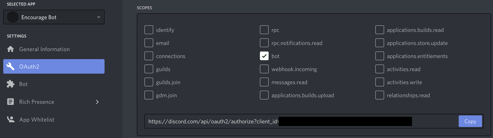
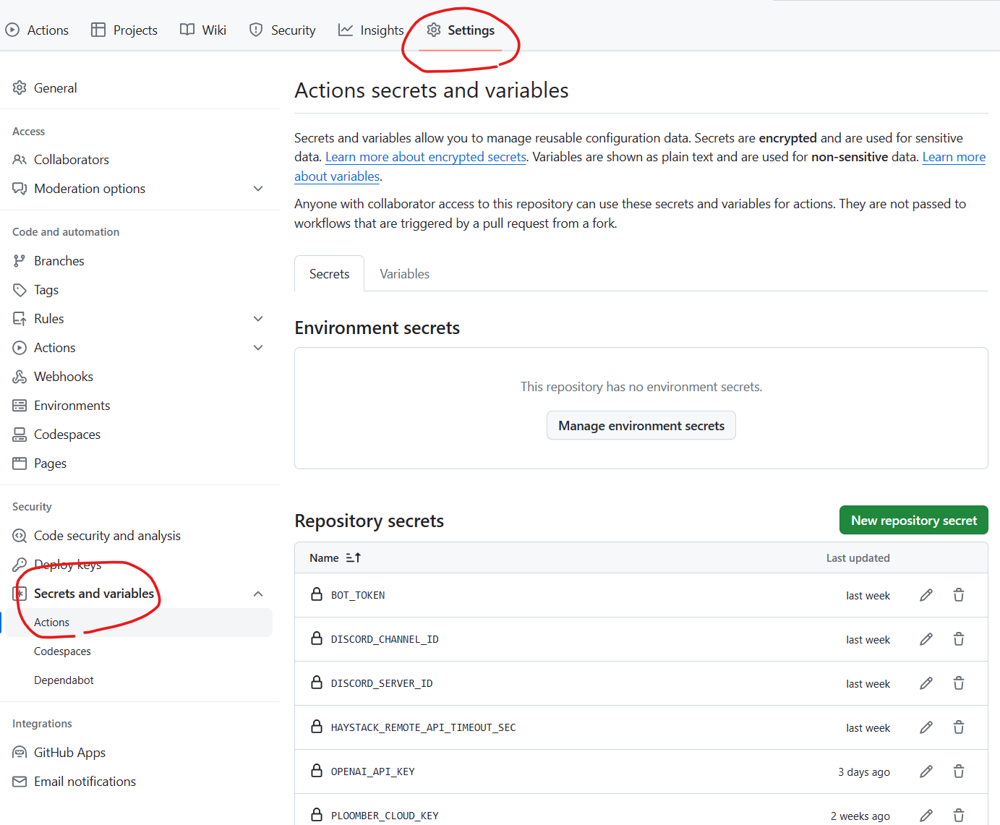

# Solarathon FAQ Creator
This application automatically creates and update an FAQ based on messages for a given Discord server. When deployed via GitHub Actions and Ploomber Cloud, you have a pipeline that regenerates the FAQ at a frequency determined by the GitHub Actions settings.


The application performs the following steps:
1. Retrieve messages from the Discord server via the Discord API.
2. Summarize the Discord messages into question-answer pairs using `OpenAI` and the `Haystack` library.
3. Display the results on a user interface using `Solara`.
	* The user can browse all question-answer pairs by category and tag.
	* The user can also enter a query which returns the most relevant question-answer pairs. This is done using `Haystack`, which retrieves documents based on cosine similarity.
4. Deploy the application to the web using `Ploomber` Cloud.

This project was created as part of the 2023 Solarathon.

# How to Implement the Code
## Setup the Discord Bot

- navigate to https://discord.com/developers/applications
- create a new bot
- save the token
- Go in the "OAuth2" section --> URL Generator
- Check the "bot" checkbox

- assign the permission "Read Message History"
- copy the generated URL:
	- https://discord.com/api/oauth2/authorize?client_id=XXXXX&permissions=65536&scope=bot
- install the Bot on your Discord Server

## Run locally

### Setup Env Variables

```
HAYSTACK_REMOTE_API_TIMEOUT_SEC=300
DISCORD_SERVER_ID=xxxxx
DISCORD_CHANNEL_ID=xxxxx
OPENAI_API_KEY=xxxxx
BOT_TOKEN=xxxxx
```

### Simulate the GitHub workflow steps locally:
```
$ pip install -r backend/discord_pipeline/requirements.txt
$ python backend/discord_pipeline/get_messages.py

$ pip install -r backend/haystack_pipeline/requirements.txt
$ python backend/haystack_pipeline/step_1_generate_faqs.py
$ python backend/haystack_pipeline/step_2_indexing.py
```

### Install and Run the Solara Web App
```
pip install -e .

solara run solarathon.pages
```

## Deploy via Github Actions

### Setup Environmental Variables in GitHub Secrets

<details>
<summary>Go to Settings -> Secrets and variables -> Actions</summary>



</details>

```
HAYSTACK_REMOTE_API_TIMEOUT_SEC=300
DISCORD_SERVER_ID=xxxxx
DISCORD_CHANNEL_ID=xxxxx
OPENAI_API_KEY=xxxxx
BOT_TOKEN=xxxxx
PLOOMBER_CLOUD_KEY=XXXXX
```

[Get your Ploomber API key](https://docs.cloud.ploomber.io/en/latest/quickstart/apikey.html) and set it as `PLOOMBER_CLOUD_KEY` in GitHub (under Settings->Secrets and Variables->Actions, and click "New repository secret")

### Do only once

 * [Sign up for Ploomber](https://www.platform.ploomber.io/register/)
 * [Get the API key](https://docs.cloud.ploomber.io/en/latest/quickstart/apikey.html) from [The Ploomber dashboard](https://platform.ploomber.io/)


```
$ ploomber-cloud key YOURKEY
$ (cd ploomber && rm ploomber-cloud.json && ploomber-cloud init)
(add to git and commit)
$ git add ploomber/ploomber-cloud.json
$ git commit -m "ci: set ploomber id"
$ git push origin master:ploomber_dev
```

### Run to deploy a new version
```
$ git push origin master:ploomber_dev
# add --force if needed
```

## Deploy manually

(Not recommended)
See https://docs.cloud.ploomber.io/en/latest/user-guide/cli.html for more details

```
$ pip install ploomber-cloud
$ mkdir -p ploomber/wheels
$ ploomber-cloud key YOURKEY
$ (cd ploomber && ploomber-cloud init)
(type y)
# build the wheel
$ (hatch build && cp dist/*.whl ploomber/wheels)
$ (cd ploomber && ploomber-cloud deploy)
```

# Contributors
## Project Team Members
* [Simone Frisco](https://www.linkedin.com/in/simonefrisco/), Data Scientist
* [Silvia Hua](https://www.linkedin.com/in/silviahua), Data Scientist
* [Arunprasadh Senthil](https://www.linkedin.com/in/arun-prasadh-senthil/), Data Engineer
* [Janet Mardjuki](https://www.linkedin.com/in/jmardjuki/), Software Developer
* [Roman Gampert](https://www.linkedin.com/in/roman-gampert-5537b9126/), Product

## Advisors
* Iisakki Rotko from Widgetti BV
* Maarten Breddels from Widgetti BV
* Laura Funderburk from Ploomber